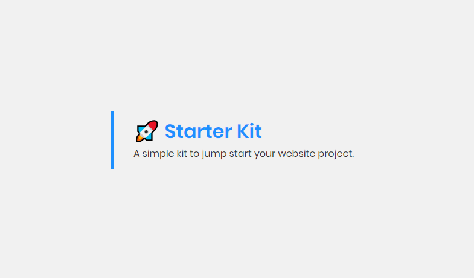

## Stater Kit
A simple kit to jump start your website project.

### Packages
- gulp
- gulp-sass
- gulp-babel
- gulp-concat
- gulp-uglify
- gulp-clean-css
- gulp-sourcemaps
- gulp-autoprefixer
- browsersync

### Main tasks
1. `gulp dev` : Start a local server and watches files for changes
2. `gulp production` : Minify images, css, js files for production

### Usage
- Create your html files in **/dist** folder.
- Create your sass and js files in **/src** folder.
- If your website depends on some javascript library:
  - Put your vendor js files in **/src/js/vendor** folder.
  - Open config.json and insert path for each vendor file in `config.src.vendor`.
  - Run `gulp minifyVendor` to minify concated vendor file.

**Okay! I hope this kit useful for you. Fell free to fork and customize it for your need.**

